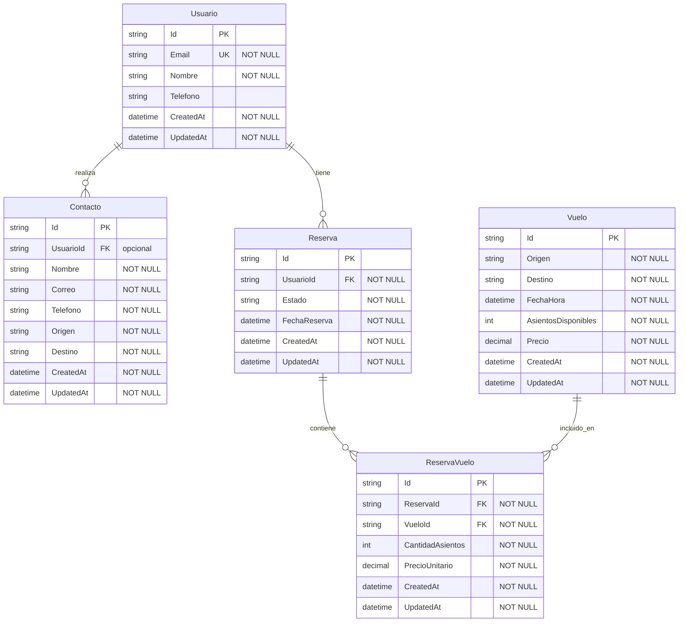

# Diagrama Entidad–Relación (DER) — JA Seguro que Vuelas

Dominio: agencia de viajes. Entidades: Usuario, Contacto (solicitud), Reserva, Vuelo, ReservaVuelo (tabla puente N–N).

## Leyenda

- **PK**: clave primaria  
- **FK**: clave foránea  
- **UK**: único (índice unique)  
- **NOT NULL**: obligatorio  
- **1–N**: Un usuario tiene muchos contactos y muchas reservas; una reserva tiene muchos ítems ReservaVuelo; un vuelo puede aparecer en muchos ítems ReservaVuelo.  
- **N–N**: Reserva ↔ Vuelo mediante la tabla puente **ReservaVuelo**.

## Restricciones e índices sugeridos

| Entidad     | Restricción / Índice |
|------------|-----------------------|
| Usuario    | `Email` UNIQUE, NOT NULL |
| Contacto   | `UsuarioId` opcional (contacto anónimo permitido) |
| Reserva    | `Estado` en dominio fijo (ej. Pendiente, Confirmada, Cancelada) |
| ReservaVuelo | Índice compuesto (ReservaId, VueloId) para evitar duplicados |
