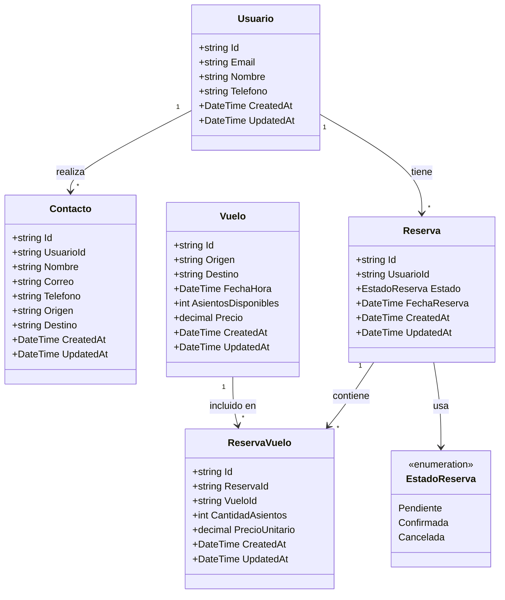

# Diagrama de Clases (UML) — JA Seguro que Vuelas

Solo entidades del dominio (no controladores).

## Multiplicidad

- **Usuario → Contacto**: 1 – N (un usuario puede tener muchas solicitudes de contacto).  
- **Usuario → Reserva**: 1 – N (un usuario puede tener muchas reservas).  
- **Reserva → ReservaVuelo**: 1 – N (una reserva tiene varios ítems de vuelo).  
- **Vuelo → ReservaVuelo**: 1 – N (un vuelo puede estar en muchas reservas).  
- **Reserva ↔ Vuelo**: N – N a través de la clase **ReservaVuelo**.

## Value objects / Enums

- **EstadoReserva**: Pendiente, Confirmada, Cancelada (regla de integridad de dominio).
